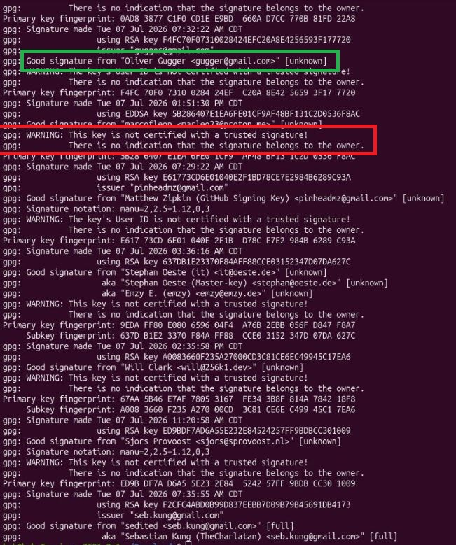

# What are we doing when we verify with GPG?

When we run this command in the guide...

```
wget -O guix.sigs.tar.gz https://github.com/bitcoin-core/guix.sigs/archive/refs/heads/main.tar.gz
tar -xzf guix.sigs.tar.gz
gpg --import guix.sigs-main/builder-keys/*
gpg --verify SHA256SUMS.asc
```

We are 
1. Downloading a tarball (zip file) of the public fingerprints of the Bitcoin Core Contributors
2. Unpacking this tarball
3. importing the fingerprints to our local gpg keychain
4. checking the signatures of the hash file that accompanies the Bitcoin software.

When Bitcoin Core cuts a release of the latest stable version of the software for users to download, it goes through a release process beforehand.

Bitcoin Core contributors will each compile the same version of the Bitcoin software locally on their own machines. This produces what's called a binary, or a precompiled piece of software that end users can download and run without all of the toolchains required for compiling it. 

After this binary gets created, it gets hashed. Hashing is a one way function that produces a unique output depending on the input. This means that if a binary is only very slightly different from another binary, the two will produce an entirely different hash. If each Bitcoin Core contributor that signs the release binary, first builds a copy of the release software on their machine, and verifies that it produces the same hash which they've signed, we can be confident that each of them has successfully reproduced the same binary from the same code. 

Their signature is their way of saying "I have checked that this binary we are releasing for users to download is the same as the source code from which it claims to be compiled."

They then take their personal GPG key (for which fingerprints are published in the github repository we called in line 1 of our script) and sign the hash file. 

After we download the Bitcoin software in the guide, we take that [published list of fingerprints of Bitcoin Core Contributors](https://github.com/bitcoin-core/guix.sigs), import them to our local GPG keychain, and verify the signatures on the hash file.

# Why Can we ignore the warning?



`WARNING: this key is not certified with a trusted signature! There is no indication that the signature belongs to the owner`

We can safely ignore this warning becuase it is not directly relevant to what we are attempting to verify. This key is not certified with a trusted signature FROM US. What this warning is telling us is that WE have not personally validated the identity of the persons associated with the key that produced this signature. WE have not personally validated that fingerprint `A123 456B C789 D012 3456 E789 0123 F456 789G 0123` actually belongs to a guy named Bob. 

If Bob is a Bitcoin Core contributor and we know Bob in real life, we could ask him to provide us with the fingerprint of his key. We could then import Bobs fingerprint to our GPG keychain and always look for Bob whenever we check a new Bitcoin Core release. Because we've met Bob and he provided us directly with his fingerprint, we can know with cryptographic certainty that the private key which produces a signature that matches Bob's finger print is owned by the same Bob we know in person.

However, we cannot know this for sure with random people who contribute to an online software project which we've never met in real life, one thing we can do with is reach out to these people (many developers will publish their fingerprints in multiple places) and ask them for their fingerprint if we know them online. And yet, even if we do this, we still cannot know with the same degree of certainty that these people are who they say they are. We CAN know with certainty that Bob is who he says he is because we have met him in person.

The only thing we can know with certainty when we check signatures of a Bitcoin Core release is that person who holds the private key that produces XYZ fingerprint, signed the hash.

The warning that we see in the results of `gpg --verify SHA256SUMS.asc` is telling us that we have not designated these fingerprints as trusted identities in our LOCAL keyring.

If we wanted to do this in order to prove to ourselves this is not a concern, we would need to first, generate a private key with which we can sign with gpg.

`gpg --full-generate-key`

Choose RSA (option 1), enter 2048, Choose key does not expire (option 0), provide a name and email (none of these things important for this exercise).

After generaring a key, we can now designate a level of trust to specific fingerprint which we've imported to our keychain. So for example, if we knew Bob's fingerprint was `A123 456B C789 D012 3456 E789 0123 F456 789G 0123` we could sign his fingerprint on our keychain with the following command.

`gpg --lsign-key A123456BC789D0123456E7890123F456789G0123`

Gpg will then ask us how much we trust this key. Since we know Bob in person, we would select the option that we trust this person's identity FULLY. We could then update our gpg trust database with 

`gpg --update-trustdb`

Now if we were to check the signatures of the hash file again with

`gpg --verify SHA256SUMS.asc`

and if the hash file had been signed by Bob, we would no longer see the previous warning under his signature, because we added it to our local web of trust on our GPG key ring. 

It's certainly not be a bad idea for you to do this, but its superfluous for the purposes of the main guide and the warning is irrelevant to our main concerns, which is that the binary we download from bitcoincore.org is what it claims to be.

Webs of trust are personal. I may know for a fact that a bitcoin core contributors fingerprint matches the person that they say they are, but you would have to take my word for it, unless you were able to verify that information for yourself, this is why GPG lets your fine tune your web of trust locally. But it's not a concern if you do not personally know the developers, and can personally validate their claimed identities when checking for signatures on the hash of a reproducible binary for a very public piece of software like Bitcoin Core. 
