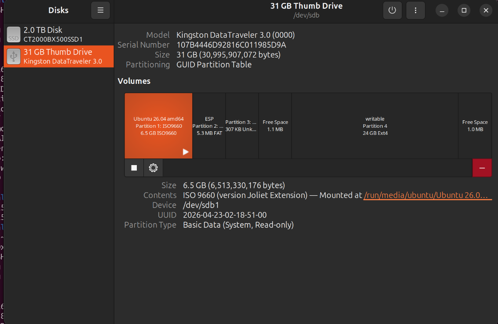

## Updating Bitcoin Core on the Full Node [online Computer]

This guide will be updated to support the latest stable release of Bitcoin Core. That means the scripts provided in this guide will not work for you if you do not have the latest version installed. When this happens the version of Bitcoin on your computer `~/bitcoin-31.1` will look different than the number in the scripts in this guide. 

To upgrade the software on your node to the latest version, simply run this command in the terminal:

```
rm -r ~/bitcoin-31.1
```

Then repeat steps A2 through A4 on your online computer. You will NOT need to redownload the blockchain after updating the software to the latest version because the Bitcoin blockchain lives in `~/.bitcoin`

## Updating Ubuntu USB stick to the latest version [online computer]

It is a good idea to keep the Ubuntu software on your bootable USB stick up to date. This means that if you have Ubuntu 26.04.1 installed on your USB, and Ubuntu releases Ubuntu 26.04.2, it is highly recommended that you also update your bootable USB to the latest Ubuntu version.

The simplest way to do this is to use your online computer to download the latest version of Ubuntu.

Open a terminal and run this command.

```
rm ~/Downloads/SHA256SUMS
rm ~/Downloads/SHA256SUMS.gpg
wget -P ~/Downloads https://releases.ubuntu.com/26.04.1/ubuntu-26.04.1-desktop-amd64.iso
wget -P ~/Downloads https://releases.ubuntu.com/26.04.1/SHA256SUMS
wget -P ~/Downloads https://releases.ubuntu.com/26.04.1/SHA256SUMS.gpg
```

Once it finishes the download run this command to verify the Ubuntu binary.

```
cd ~/Downloads && gpg --keyid-format long --keyserver hkp://keyserver.ubuntu.com --recv-keys 0x46181433FBB75451 0xD94AA3F0EFE21092
gpg --keyid-format long --verify SHA256SUMS.gpg SHA256SUMS
sha256sum -c SHA256SUMS --ignore-missing

```

Once you've verified a good signature on the Ubuntu image, you need to insert your Ubuntu USB stick into the online computer and perform 2 tasks:

Note: it is a good idea to stop your Bitcoin Node before doing this with

```
~/bitcoin-31.1/bin/bitcoin-cli stop
```

1. Open Disks with this command in the terminal

```
gnome-disks
```

Select your USB drive from the left hand side menu.



Next look at the line that says `Device` and make a note of the path to your USB stick. Here you can see our path is `/dev/sdb`. YOURS MAY BE DIFFERENT.

2. Flash the USB stick with latest ubuntu version

Run the following command in your terminal. Replace `<path/to/usb>` on both lines with the actual Device path to your USB stick.

```
sudo umount <path/to/usb>*
sudo dd if=~/Downloads/ubuntu-26.04.1-desktop-amd64.iso of=<path/to/usb> bs=4M status=progress conv=fsync oflag=direct
```

The finished command will look similar to this. YOURS MAY BE DIFFERENT.

`sudo umount /dev/sdb*`
`sudo dd if=~/Downloads/ubuntu-26.04.1-desktop-amd64.iso of=/dev/sdb bs=4M status=progress conv=fsync oflag=direct`

The terminal will ask you to enter your password. This is the password you set up when first installing Ubuntu on the computer. Type in the password and press enter. Wait for it to finish, it might take a while. 

You've now successfully updated the Ubuntu software for your offline computer.