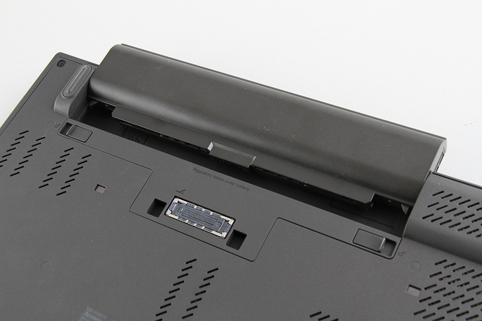
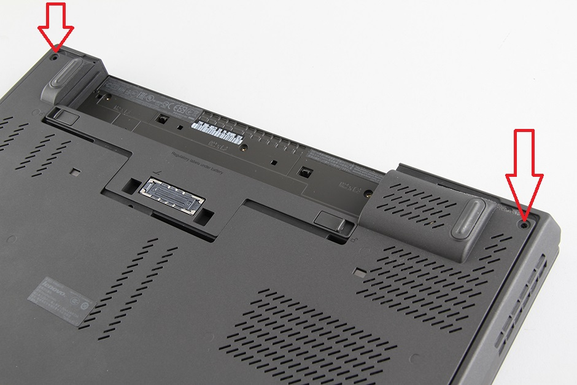
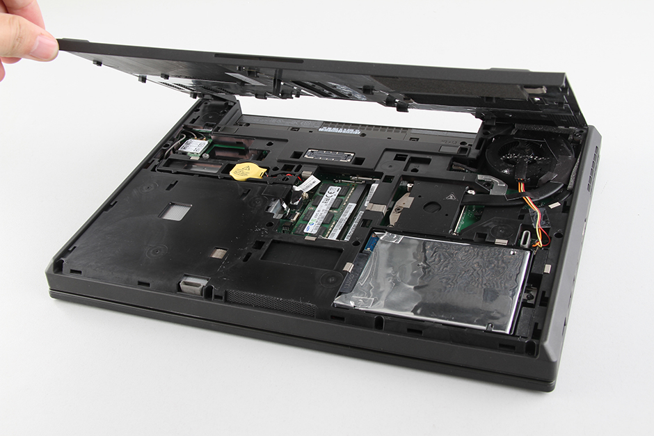
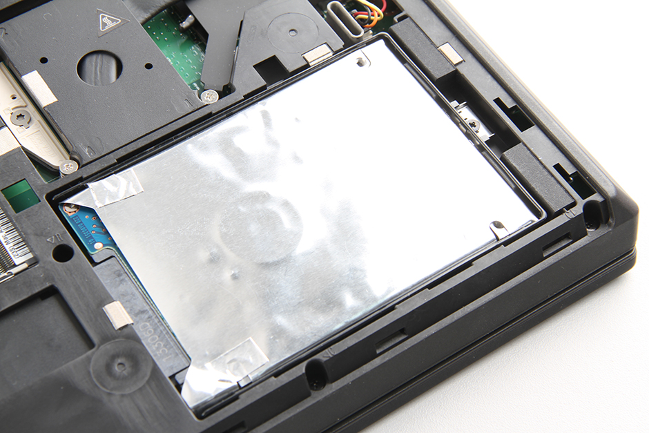
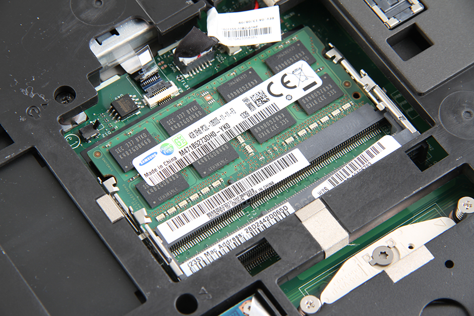

# How to Upgrade the storage drive in a laptop

Replacing the internal storage drive in a laptop computer is not difficult, even though it might first seem intimidating, it is a necessary process for making our full node computer more reliable.

The reason we choose to upgrade our online computer to a full archival node instead of pruning is to alleviate the annoying difficulties that can sometimes come with attempting to load a wallet into a pruned node.

If you are intimidated by this process, the best thing to do is to look up a teardown guide for your specific model laptop. The steps here will be for a Thinkpad T440, which will only provide you a more generalized overview if your model laptop is different.

If you would, for some reason, prefer not to do this, [see here](FAQ.md#q-can-i-use-a-pruned-node) for a brief pruning guide. 

## Removing the Cover

You will need a small phillips head screwdriver.

First ensure the laptop is turned off and unplugged. Then, close the laptop and turn it over so that you are looking at the bottom of the device. Next, unlock and remove the battery from the device.

Next Remove the two screws in the top right and left corner on either side of the battery port.

Then gently pry up the cover panel from the bottom of the laptop. If it feels stuck you might have missed a screw. 

After removing the cover you may need to remove any screws that secure the hard drive to the laptop case. Then carefully unplug the existing SATA drive and remove it from the computer. 

Plug the new SATA SSD into the connector port, fit the drive into the slot, and reassemble the computer.

Optionally, you can also choose to upgrade the RAM of this computer (this will improve the performance of the computer but is not necessary). These sticks are usually cheap, make sure that you buy a second stick of the same memory size and form factor of the existing chip in your computer. For example, if your laptop contains a 4GB DDR3L-1600MHz chip, ensure you get a second one just like it and plug it into the second RAM port. 

